```matlab
x = linspace(-10, 10);
```

```matlab
f = @(x) x + sin(5*x) .* exp(-x.^2);  % 1
figure, plotY(f, x, "highlyOscillatory1");
```

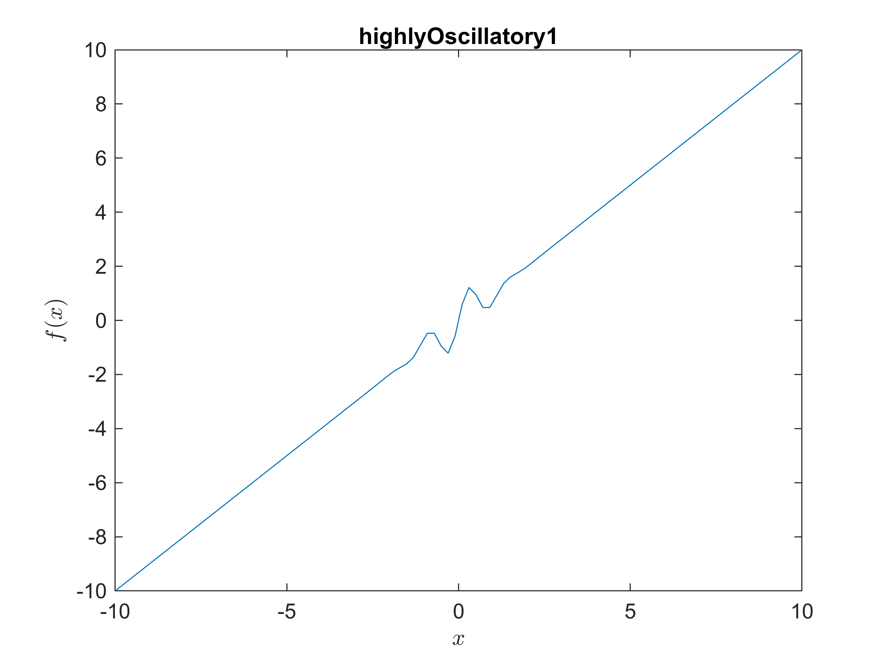

TN succeeds.


CN succeeds, but slower.

```matlab
openfig("fig\TNCN_convPath_highlyOscillatory1.fig");
```

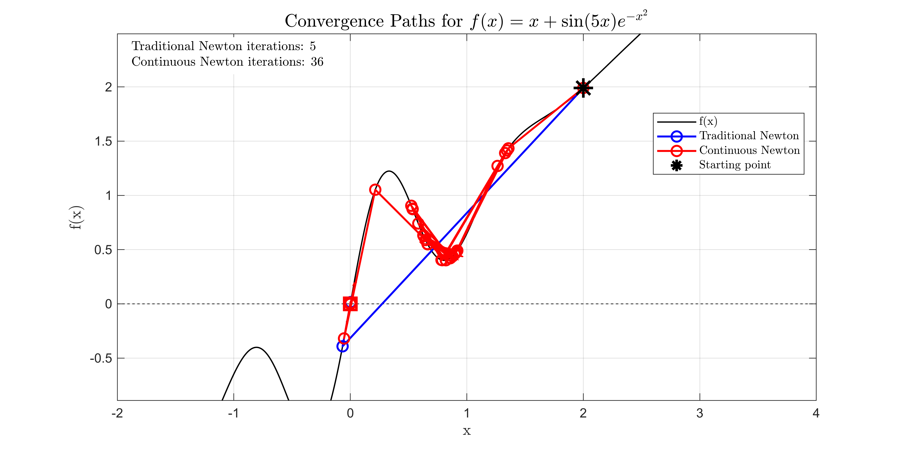

Note that TN is successful by good luck. CN is slower, but its iteration looks much more reasonable, as it doesn't jump too far way.

```matlab
f = @(x) x + sin(x.^2);  % 2
figure, plotY(f, x, "highlyOscillatory2");
```

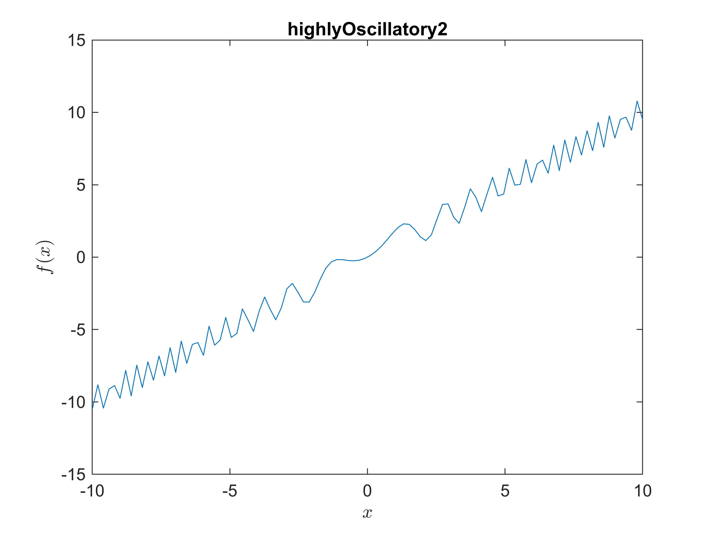

TN fails.


CN wins at tau=1e\-1.

-  Very large tau behaves like TN. 
-  Small tau means slower convergence, and it can succeed (here, tau = 1e\-2). 
```matlab
openfig("fig\TN_convPath_highlyOscillatory2.fig");
```

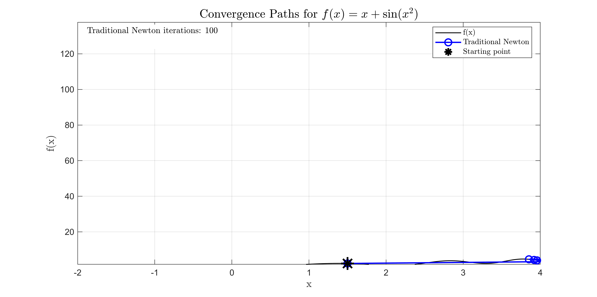

Boom! TN fails!

```matlab
openfig("fig\CN_convPath_highlyOscillatory2.fig");
```

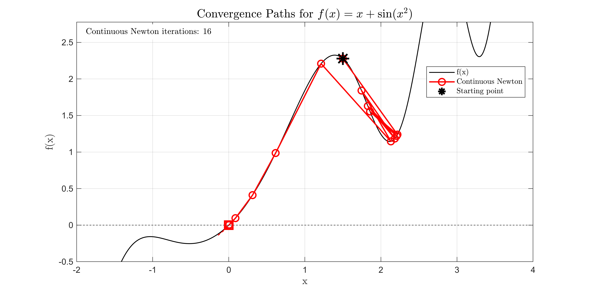

CN wins, though it lingers around a local minimum.

```matlab
openfig("fig\CN_convPath_highlyOscillatory2_smallTau.fig");
```

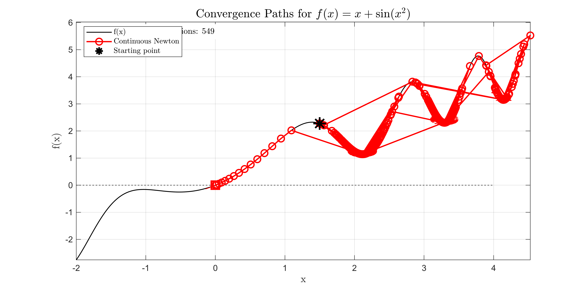

I set a very small tau. It leads to more conservative CN procedure, and it still eventually succeeds. The problem of lingering around a local minimum is much more evident.

```matlab
f = @(x) x + sin(8*x)./(1 + x.^2);  % 4
figure, plotY(f, x, "highlyOscillatory4");
```

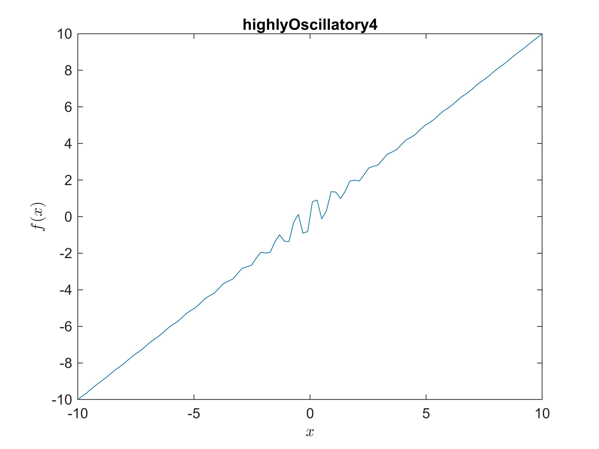

TN succeeds, but by very good luck.


CN at moderate tau (1e\-1): succeeds, but it jumps too far away!

```matlab
openfig("fig\TNCN_convPath_highlyOscillatory4.fig");
```

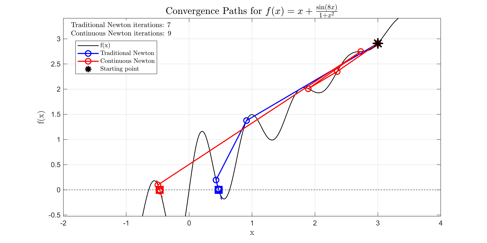

CN happens to converge at a far away solution. This shows bad luck for CN and very good luck for TN.

```matlab
openfig("fig\TNCN_convPath_highlyOscillatory4_smallTau.fig");
```

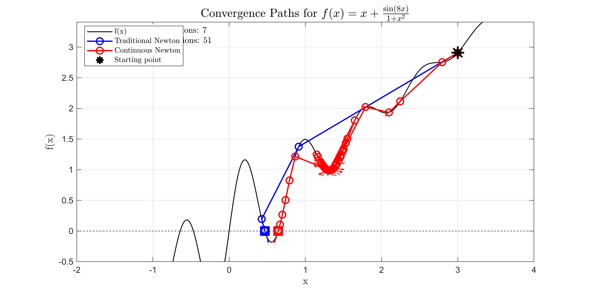

CN at loose tau (1e\-0): Behaves the same with TN


CN at strict tau (1e\-2): succeeds with slower convergence. But the procedure looks more reasonable and "safer".


Note that CN lingers around a local minimum for too many times, until it gets close to the bottom, where Jacobian is small and hence it gets a very large step size to move out of this 


This INSPIRES ME TO MAKE IMPROVEMENT!!!

```matlab
x = linspace(0, 5);
f = @(x) x .* (1 + sin(5*x)) .* (1 + 0.5*sin(10*x));  % 5
figure, plotY(f, x, "highlyOscillatory5");
```

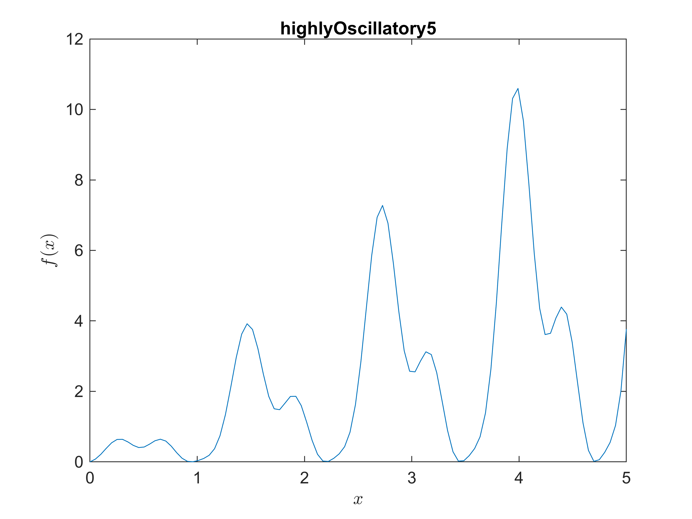

```matlab
openfig("fig\TNCN_convPath_highlyOscillatory5_145.fig");
```

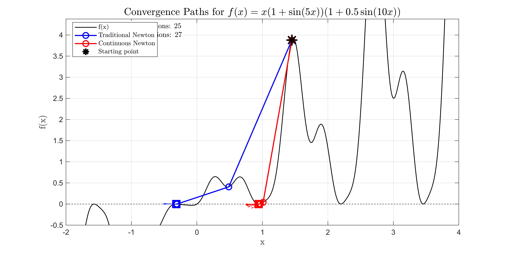

Both converged. But TN converged not at the nearest solution.

```matlab
openfig("fig\TNCN_convPath_highlyOscillatory5_147.fig");
```

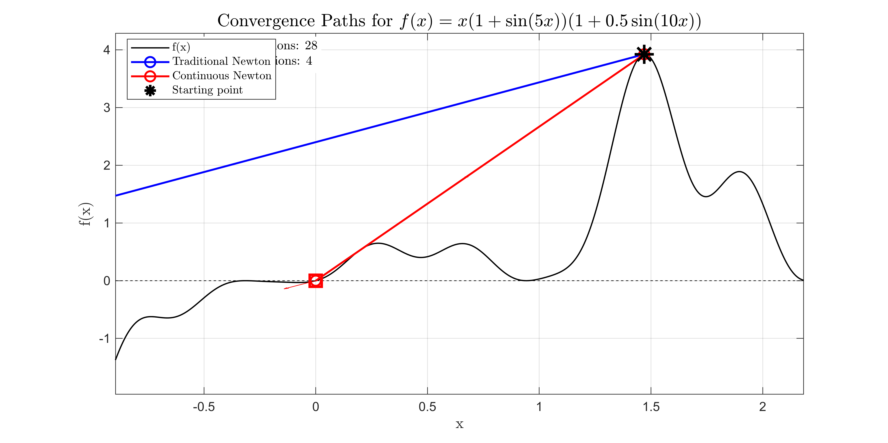

TN flies away! CN succeeds, with an acceptable yet not the closest solution.

```matlab
openfig("fig\TNCN_convPath_highlyOscillatory5_148.fig");
```

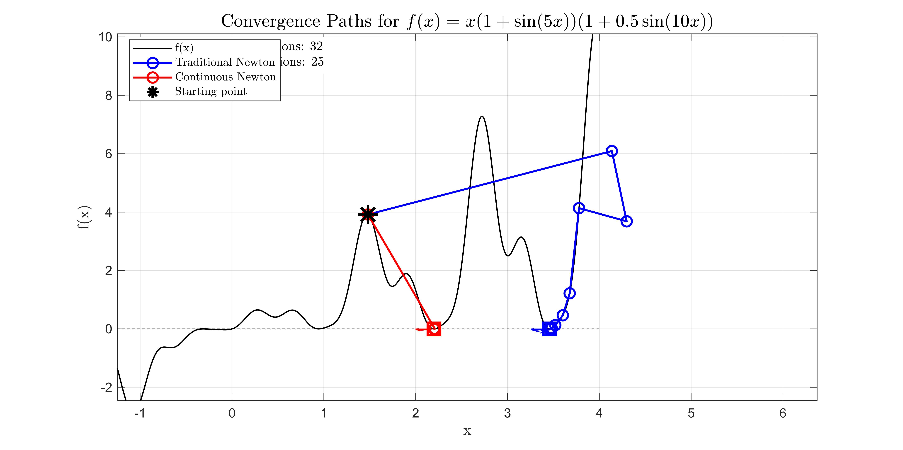

Both converged. But TN converged not at the nearest solution.

```matlab
openfig("fig\TNCN_convPath_highlyOscillatory5_n066.fig");
```

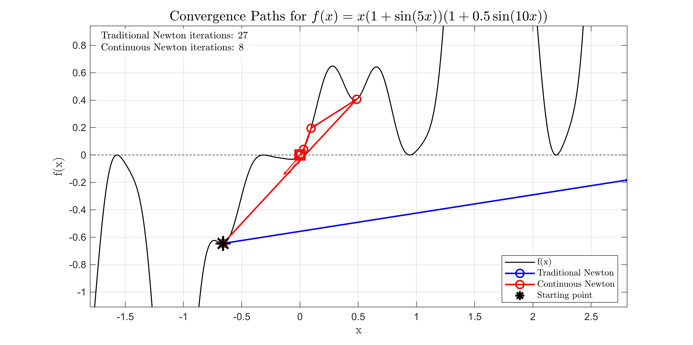

TN flies away! CN succeeds, with an acceptable yet not the closest solution.

```matlab
function plotY(f, x, Title)
    if nargin < 3
        Title = "";
    end
    y = f(x);
    plot(x, y);
    title(Title), xlabel(' $x$ ', 'Interpreter','latex'), ylabel(' $f(x)$ ', 'Interpreter','latex')
end
```
